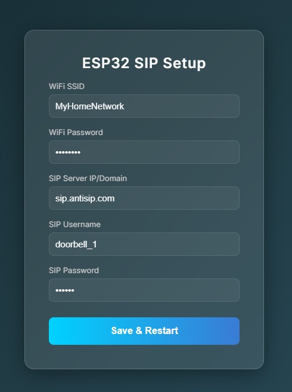
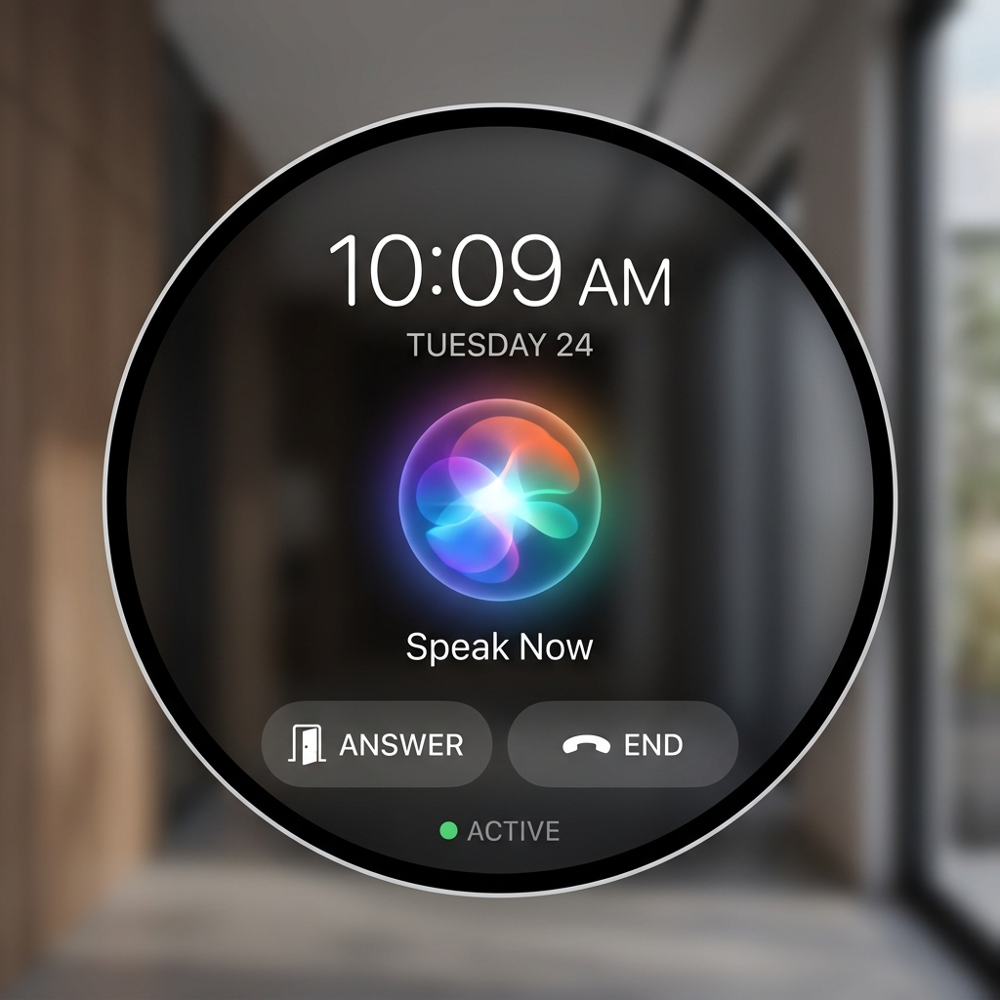
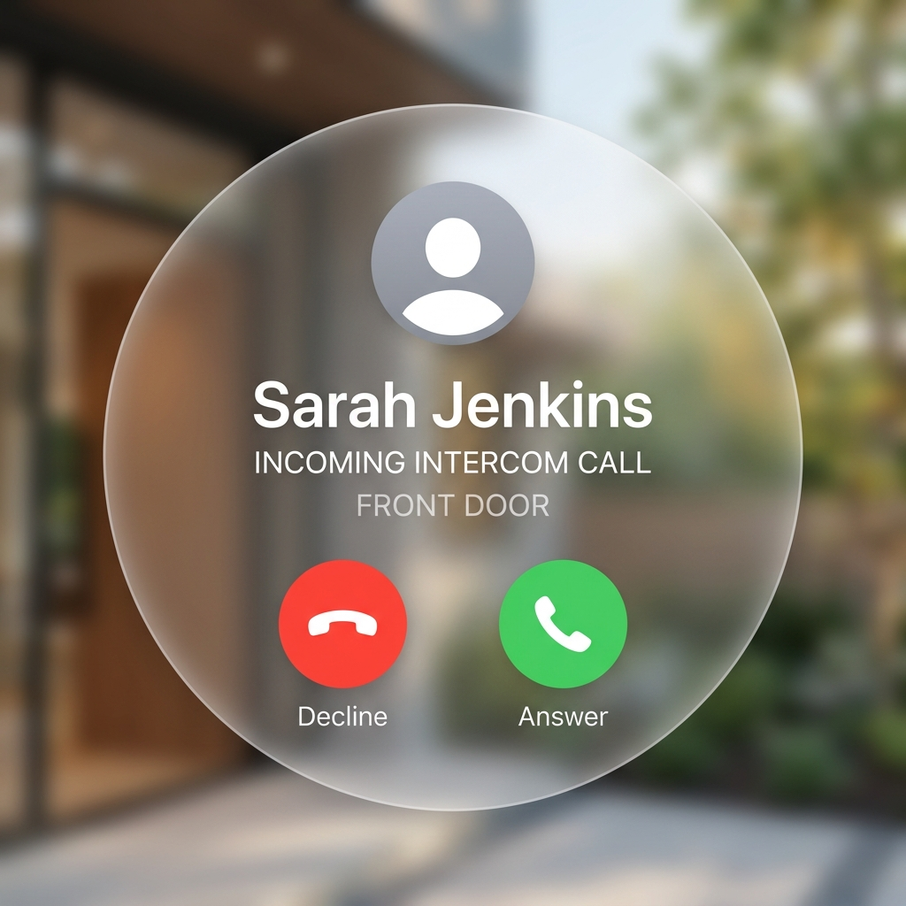
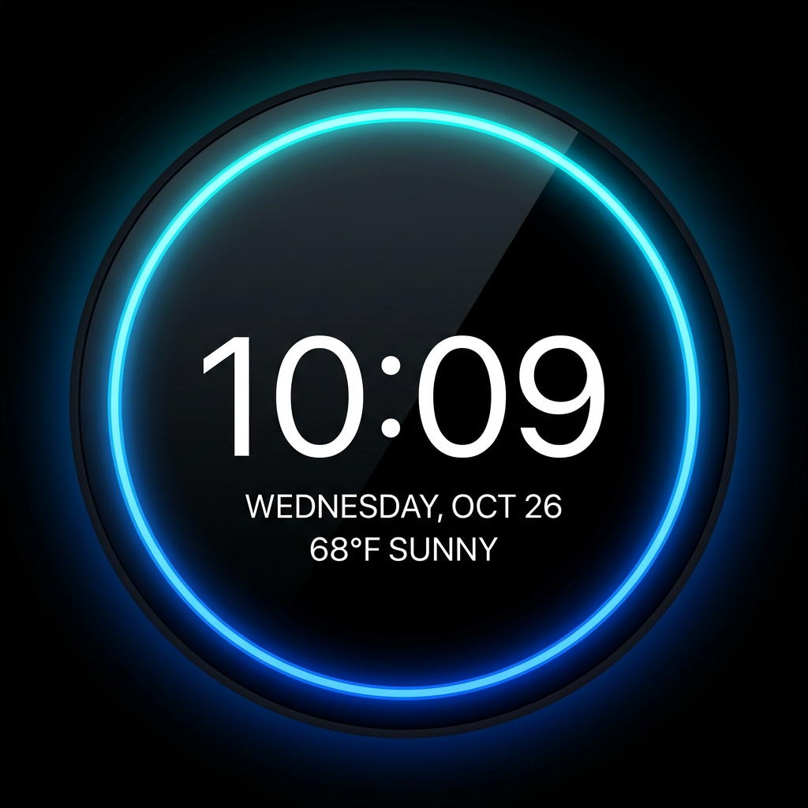
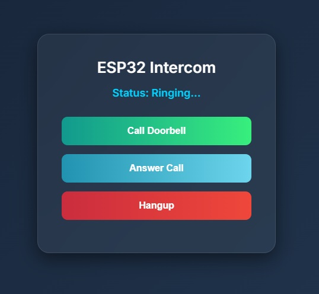

# ESP32-SIP-Voice Phone

A fully functional ESP32-based SIP VoIP client built on ESP-IDF and FreeRTOS. 

This project provides a robust, production-ready foundation for VoIP intercommunication, doorbells, or smart home voice terminals.

## Features

* **Full SIP Stack**: Supports UDP-based SIP signaling with MD5 Digest Authentication (handles 401/407 responses). Robust state machine handling `INVITE`, `BYE`, `CANCEL`, and `ACK` transactions with proper `Call-ID`, `CSeq`, and `Tag` matching.
* **HD Voice & Dynamic Codecs**: Features automatic SDP negotiation supporting both **G.722 (16 kHz HD Voice)** and standard G.711 µ-law/A-law (8 kHz) with dynamic I2S sample rate switching.
* **Audio Pipeline & RTP**: Asynchronous I2S audio reading/writing combined with a fully implemented **Jitter Buffer**. Includes Packet Loss Concealment (PLC) via zero-stuffing to maintain I2S hardware timing during packet loss.
* **Graphical User Interface (LVGL)**: Full Touchscreen support (ST7789/ILI9341 via SPI) and touch controllers (e.g., XPT2046) using the industry-standard LVGL library. Includes a visual dialer, active call screen, and incoming call alerts.
* **Edge AI Voice Activation (Wake Word)**: Integrated `esp-sr` WakeNet! The intercom constantly listens locally for a Wake Word (e.g., "Computer") to initiate a SIP call without physical interaction or cloud connectivity.
* **PC Simulator**: Develop and test the LVGL User Interface directly on your Windows/Mac/Linux PC using the included SDL2 Simulator, without needing to flash the ESP32!
* **Hardware & Web Control**:
  * **Dynamic Hardware Config:** Change I2S, I2C, and SPI GPIO pins directly through the web interface without recompiling the firmware!
  * Captive Portal for Wi-Fi and SIP credentials setup.
  * Matrix Keypads (4x4 GPIO or I2C) for physical dialing.
  * Web-based Phonebook (Speed Dial) saved securely in NVS.
  * DTMF Tone Parsing (via SIP INFO) for remote access (e.g., opening a door).
* **NAT Traversal (STUN) & Keep-Alive**: Built-in STUN client to discover the public IP/Port behind routers, and periodic UDP Keep-Alive signaling to maintain open router ports.

## Kconfig Hardware Profiles (Tier Architecture)
To ensure the firmware runs optimally across various Espressif chips without memory exhaustion, we use `Kconfig.projbuild` profiles:
* **LITE**: For ESP32-C3. G.711 only, internal SRAM jitter buffer, no heavy DSP.
* **STANDARD**: For standard ESP32 (WROVER). G.722 HD Voice, LVGL GUI, dynamic hardware engine.
* **PRO / AI**: For ESP32-S3 with PSRAM. Full-Duplex AEC (esp-sr), Ultra-HD OPUS Codec, and Wake Word detection. Includes a massive 100KB+ PSRAM Jitter Buffer (inspired by *Ka-Radio32*) for flawless RTP streaming.

## Supported Environments & Versions

While this project is designed to be highly portable across ESP-IDF versions and ESP32 hardware, the following environments are supported (but not strictly limited to):

*   **ESP-IDF Versions**: v4.4, v5.0, v5.1+
*   **Supported Chips**: 
    *   ESP32 (Classic dual-core WROVER/WROOM)
    *   ESP32-S2, ESP32-S3 (With PSRAM and Vector instructions for AI)
    *   ESP32-C3 (RISC-V single-core, for LITE profile)
*   **Supported Boards (Thanks to Dynamic GPIO Config)**:
    *   M5Stack (Core, Core2, Dial)
    *   LilyGo (T-Display, T-Embed)
    *   Waveshare (ESP32-S3-Touch-LCD series)
    *   Guition, Spotpear, and 70+ other generic boards from AliExpress!
*   **Audio Codecs**: 
    *   I2S Breakouts (e.g., INMP441 Mic + MAX98357A DAC)
    *   I2C Codecs (e.g., ES8388, ES8311 on AudioKit boards)
*   **Displays**:
    *   Standard TFT (ST7789, ILI9341)
    *   Circular LCDs (GC9A01)

## Web Interface

The project includes a built-in lightweight HTTP server for configuration and call management.

### Captive Portal (Initial Setup)
When Wi-Fi or SIP credentials are missing, the ESP32 hosts an AP (ESP-SIP-Setup). Connect to it and navigate to 192.168.4.1 to enter your credentials.


### Call Control Interface & UI Themes
Once connected to Wi-Fi and registered with your SIP Server, you can control calls via the web interface by visiting the ESP32's assigned IP address. The web interface also allows you to dynamically switch the LVGL GUI Theme on the device!

| Voice Assistant | Mobile OS | Smart Speaker |
|:---:|:---:|:---:|
|  |  |  |




## Common Use Cases

*   **Smart SIP Doorbell (Doorphone):** Connect a button to the ESP32. When pressed, it calls your smartphone via a SIP server (like Asterisk or FreePBX), allowing you to talk to the guest.
*   **Smart Home Intercom:** Use with Home Assistant (via SIP integration) to create room-to-room intercoms or broadcast announcements.
*   **Emergency Call Button:** A standalone Wi-Fi button that dials a predefined emergency contact or nursing station instantly.
*   **Paging / Public Address System:** With `CTRL_METHOD_AUTO` (auto-answer) enabled, the ESP32 can be connected to an amplifier to act as an IP speaker for warehouse or office paging.

## Project Structure

```
esp32_sip_client/
├── components/
│ ├── audio_pipeline/     # I2S Task, G.722 & G.711 codecs, Jitter Buffer, PLC
│ ├── hal/                # Hardware Abstraction (TFT, Touch, Keypad Matrix, Codecs)
│ ├── sip_client/         # SIP Stack, STUN, Auth, and Signaling
│ └── ui_lvgl/            # LVGL Graphical User Interface screens
├── main/
│ ├── main.c              # App entry point, Event loop setup
│ ├── wifi_manager.c      # Wi-Fi connection logic & Captive Portal
│ └── app_config.h        # Central configuration file
├── simulator/            # PC Simulator (SDL2) for LVGL UI testing
├── sdkconfig             # Generated by menuconfig
└── CMakeLists.txt        # Project CMake file
```

## How to Build and Flash

1. **Prerequisites**: Ensure you have [ESP-IDF v4.4 or later](https://docs.espressif.com/projects/esp-idf/en/latest/esp32/get-started/) installed.
2. **Pick a tier** (memory profile) with `idf.py menuconfig` → *ESP32 SIP Voice Configuration* → LITE / STANDARD / PRO. This selects the codec set (G.711 / +G.722 / +OPUS+AEC+WakeNet).
3. **Configure credentials** — easiest at runtime: flash, connect to the **`ESP-SIP-Setup`** Wi-Fi AP, open `192.168.4.1`, and enter Wi-Fi/SIP details (stored in NVS). Compile-time fallbacks live in `main/app_config.h` (`WIFI_*`, `SIP_*`, pinout, `USE_CODEC_*`, `CTRL_METHOD_*`, optional `WEB_UI_PIN`). GPIO pins are also editable from the web *HW Config* page.
4. **Build & flash**:
   ```bash
   idf.py set-target esp32        # or esp32s3 / esp32c3
   idf.py build
   idf.py -p (YOUR_PORT) flash monitor
   ```
5. **(Wake word)** Flash a WakeNet model into the `model` partition (defined in `partitions.csv`). With `CONFIG_MODEL_IN_SPIFFS=y` the model is bundled automatically by esp-sr during `flash`. Needs an 8 MB board; on 4 MB boards set `USE_WAKE_WORD 0`.
6. **(OPUS / PRO)** OPUS is compiled only when libopus is on the include path. Add an IDF opus component to `components/audio_pipeline/idf_component.yml` (e.g. `chmorgan/esp32-libopus`) — `opus_codec.c` auto-detects `<opus.h>`.

## Next Steps & Important Considerations (TO DO)

*   **SRTP (Secure RTP):** Full encryption of the audio stream using SRTP is required for complete privacy. This is currently deferred until the official ESP-ADF framework integration.
*   **SIPS (TLS) Completion:** The foundation for SIP over TLS (esp_tls_t) has been conditionally added (USE_SIPS), but requires proper certificate provisioning and server-side testing to fully implement secure SIP signaling.
*   ~~**Dynamic Codec Negotiation:** Expanding the SDP parser to parse rtpmap dynamically and negotiate codecs like OPUS, rather than defaulting to G.711 µ-law (or G.722).~~ *(Completed in v1.5.0)*
*   ~~**Hardware Validation:** Testing the I2C OLED (SSD1306), TFT Touchscreen, Captive Portal, and I2S codecs together on a physical prototype or custom PCB.~~ *(Completed via Dynamic GPIO Config in v1.7.0)*
*   **Full-Duplex AEC (Acoustic Echo Cancellation):** A real NLMS adaptive echo canceller is now implemented in software (`components/audio_pipeline/aec_filter.c`) and runs on plain ESP32/S3. For maximum quality on the PRO tier you can additionally route to esp-sr's hardware-accelerated AEC.
*   **Power Optimization:** Exploring ESP32 Deep Sleep and Wi-Fi Light Sleep modes to reduce power consumption while maintaining SIP registration for battery-powered intercoms.

## Version History
* **v2.2.0** - **Functional LVGL UI.** The three themes are now actually driven, not just static mock-ups:
  * LVGL is properly pumped (2 ms tick + handler task + thread-safe lock); the panel is initialised for **ST7789 / ILI9341 / GC9A01** (previously only GC9A01 was wired and `panel_handle` didn't even link under the default ST7789 build).
  * Real **clock with SNTP** time sync; geometry is detected from the actual panel (`display_tft_is_round()`), not a hardcoded 240×240.
  * Themes react to call state: **Voice Assistant** (clock + glowing orb + Speak/Answer/End), **Mobile OS** (avatar + caller + Decline/Answer), **Smart Speaker** (neon ring + big clock idle face → call info during a call).
  * **Touch** (XPT2046) is now actually read and bridged to LVGL, so the on-screen Answer/End buttons work (raw bounds are panel-specific — calibrate `TOUCH_*` in `app_config.h`). SIP call events are wired to the UI and the UI buttons back to the SIP client.
  * Shared `app_config.h`/`config_manager` moved to a `config_store` component so the driver/UI components compile without a circular dependency on `main`.
  * Note: the photographic blurred backgrounds in the design renders are not reproducible on the panel; the firmware draws solid/gradient backgrounds. Enable the Montserrat fonts (done in `sdkconfig.defaults`) for the large clock.
* **v2.1.0** - **Stabilisation & real DSP release.** Fixed the project so it actually builds and runs end-to-end on ESP-IDF:
  * Corrected ESP-IDF project layout (top-level `project()` CMake + `main/` component with proper `REQUIRES`); extracted the missing `audio_pipeline.h` / `rtp_handler.h` / `g711_codec.h` / `codec_driver.h` headers.
  * **Real codecs (no more stubs):** full ITU-T **G.711 µ-law _and_ A-law** companding, a complete **ITU-T G.722** sub-band ADPCM implementation, and an **OPUS** wrapper over libopus (auto-detected).
  * **Real software AEC:** NLMS adaptive echo canceller (replaces the half-duplex attenuation stub).
  * **Dynamic codec negotiation applied end-to-end:** the SDP-negotiated payload type now drives the encoder/decoder and live I2S sample-rate switching (8/16/48 kHz).
  * **SIP hardening:** RFC 2617 Digest with `qop=auth` (cnonce/nc), correct response routing to the request source, single-ACK on 200 OK, audio start on _incoming_ calls, INVITE re-auth on 401/407.
  * **RTP:** non-blocking receive (no more audio-task stalls), corrected 16-bit buffer sizing, fixed PSRAM jitter-buffer allocation.
  * **WakeNet** ported to the esp-sr **2.x** model-loader API.
  * **Web UI:** raised HTTP handler limit, optional PIN (HTTP Basic Auth), HTML-escaped fields, captive-portal catch-all, bounds-checked rendering.
  * Added `partitions.csv` + `sdkconfig.defaults`, fixed the UTF-16 `.gitignore`.
* **v2.0.0** - Implemented **Edge AI Voice Activation (Wake Word)**! Integrated the `esp-sr` WakeNet framework. The intercom now continuously listens to the microphone locally (offline) and automatically dials a pre-configured SIP number upon hearing the Wake Word (e.g., "Computer").
* **v1.9.0** - Refined **Multi-Theme UI Engine**: The *Smart Speaker* theme now automatically detects screen geometry! Circular displays (e.g. GC9A01) render a **Minimalist Clock** aesthetic (clock with outer glowing ring), while rectangular displays (e.g. ST7789) render a **Dashboard** aesthetic (cards with a bottom glowing light bar).
* **v1.8.0** - Implemented **Multi-Theme LVGL UI Engine** for circular displays (GC9A01) and traditional screens. Includes 3 dynamically switchable aesthetics via the Web UI: Voice Assistant style, Mobile OS style, and Smart Speaker style. Fully localized font mapping supporting multi-language phonebooks (including Cyrillic).
* **v1.7.0** - Added **Dynamic Hardware Config Engine**. Change GPIO pins for I2S, SPI, and I2C via the Web Interface and store them in NVS. Flash once, configure anywhere!
* **v1.6.0** - Introduced **Tier Architecture** via `Kconfig.projbuild` (LITE, STANDARD, PRO) to support C3/S3 chips gracefully. Implemented a massive **PSRAM-backed Jitter Buffer** for WROVER/S3 chips to eliminate RTP network stuttering.
* **v1.5.0** - Added HD Voice (G.722 Codec) integration. Implemented automatic SDP codec negotiation (fallback from G.722 to PCMA/PCMU) and dynamic I2S sample rate switching (16 kHz / 8 kHz).
* **v1.4.0.1** - Added LVGL PC Simulator (SDL2). Isolated `simulator/` directory with standalone CMake setup to test and develop the Graphical User Interface on Windows/Mac/Linux without requiring ESP32 hardware or flashing.
* **v1.4.0** - Added Touchscreen GUI foundation: Integration with LVGL (Light and Versatile Graphics Library) and Touch controllers (e.g., XPT2046). Implemented visual Dialer, Calling, and Incoming screens.
* **v1.3.0** - Transition to full SIP Phone capabilities: Added support for 4x4 matrix keypads (GPIO & I2C options), color TFT displays (ST7789/ILI9341), Web-based Phonebook / Speed Dial saved in NVS, and DTMF (SIP INFO) tone parsing.
* **v1.2.0** - Added Captive Portal (Web Setup via AP mode), Half-duplex Acoustic Echo Suppression for ESP32-C3, OLED Display support (SSD1306 via I2C), and structural SIPS (TLS) integration.
* **v1.1.0** - Refactored project architecture: Full SIP State Machine with MD5 auth, STUN implementation, Jitter Buffer / PLC for RTP, Dual Codec support (ES8388 & I2S), and modular UI controller (Buttons/Web/Auto-answer).
* **v1.0.0** - Initial base template with placeholder functions and basic Wi-Fi connectivity.

## License
MIT License

## Contact

For questions or support, visit [George Bregman's Website](https://georgebregman.com/).
