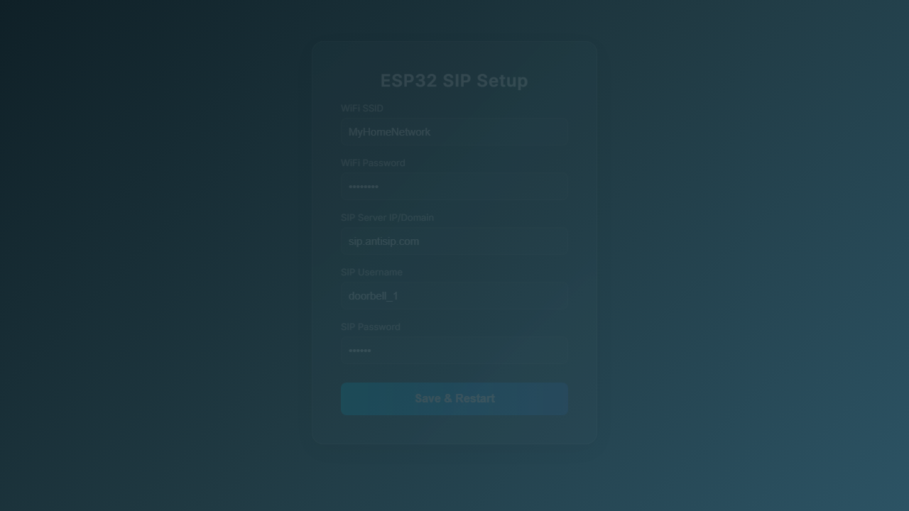
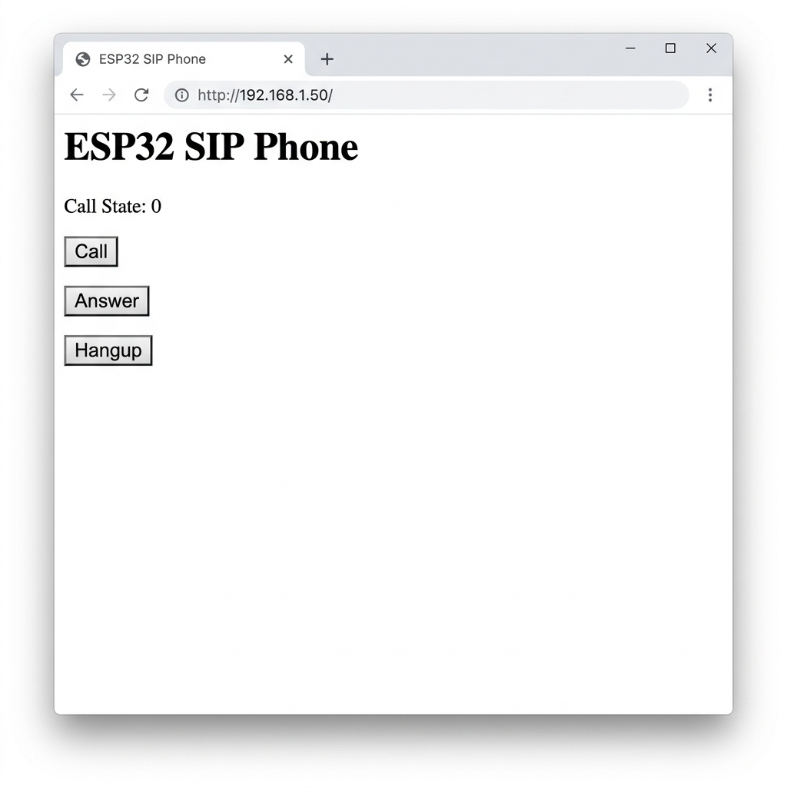

# ESP32-SIP-Voice

A fully functional ESP32-based SIP VoIP client built on ESP-IDF and FreeRTOS. 

This project provides a robust, production-ready foundation for VoIP intercommunication, doorbells, or smart home voice terminals.

## Features

* **Full SIP Stack**: Supports UDP-based SIP signaling with MD5 Digest Authentication (handles 401/407 responses). Robust state machine handling `INVITE`, `BYE`, `CANCEL`, and `ACK` transactions with proper `Call-ID`, `CSeq`, and `Tag` matching.
* **Audio Pipeline & RTP**: Asynchronous I2S audio reading/writing combined with a fully implemented **Jitter Buffer**. Includes Packet Loss Concealment (PLC) via zero-stuffing to maintain I2S hardware timing during packet loss. Uses standard G.711 µ-law (PCMU) codec.
* **Dual Codec Support**: Supports high-end I2C codecs or low-cost I2S breakouts. Configurable via `app_config.h`:
  * `USE_CODEC_ES8388`: I2C configuration for AudioKit boards.
  * `USE_CODEC_INMP441_MAX98357A`: Plug-and-play support for standard I2S microphones and DACs.
* **NAT Traversal (STUN) & Keep-Alive**: Built-in STUN client to discover the public IP/Port behind routers, and periodic UDP Keep-Alive signaling to maintain open router ports.
* **Flexible UI Control**: Choose how the device interacts with calls:
  * `CTRL_METHOD_BUTTONS`: Hardware GPIO button for answering/hanging up/calling.
  * `CTRL_METHOD_WEB`: Lightweight built-in HTTP server to control calls from a browser.
  * `CTRL_METHOD_AUTO`: Auto-answer mode for intercom or paging systems.

## Supported Environments & Versions

While this project is designed to be highly portable across ESP-IDF versions and ESP32 hardware, the following environments are supported (but not strictly limited to):

*   **ESP-IDF Versions**: v4.4, v5.0, v5.1+
*   **Supported Hardware**: 
    *   ESP32 (Classic dual-core)
    *   ESP32-S2, ESP32-S3
    *   ESP32-C3 (RISC-V single-core, with Half-Duplex AEC)
*   **Audio Codecs**: 
    *   I2S Breakouts (e.g., INMP441 Mic + MAX98357A DAC)
    *   I2C Codecs (e.g., ES8388, typically on AudioKit boards)

## Web Interface

The project includes a built-in lightweight HTTP server for configuration and call management.

### Captive Portal (Initial Setup)
When Wi-Fi or SIP credentials are missing, the ESP32 hosts an AP (ESP-SIP-Setup). Connect to it and navigate to 192.168.4.1 to enter your credentials.


### Call Control Interface
Once connected to Wi-Fi and registered with your SIP Server, you can control calls via the web interface by visiting the ESP32's assigned IP address.



## Project Structure

```
esp32_sip_client/
├── main/
│ ├── main.c              # App entry point, Event loop setup
│ ├── wifi_manager.c      # Wi-Fi connection logic
│ ├── sip_client.c        # SIP Stack, STUN, Auth, and Signaling
│ ├── rtp_handler.c       # RTP packetization and Jitter Buffer
│ ├── audio_pipeline.c    # I2S Task, G.711 encode/decode, PLC
│ ├── g711_codec.c        # G.711 µ-law implementation
│ ├── codec_driver.c      # Dual driver (ES8388 / INMP441)
│ ├── ui_controller.c     # Web interface & Button GPIO logic
│ └── app_config.h        # Central configuration file
├── sdkconfig             # Generated by menuconfig
└── CMakeLists.txt        # Project CMake file
```

## How to Build and Flash

1. **Prerequisites**: Ensure you have [ESP-IDF v4.4 or later](https://docs.espressif.com/projects/esp-idf/en/latest/esp32/get-started/) installed.
2. **Configure**: Open `main/app_config.h` and configure:
   * `WIFI_SSID` & `WIFI_PASSWORD`
   * `SIP_SERVER_IP`, `SIP_USER`, `SIP_PASSWORD`
   * I2S and I2C Pinout
   * Codec Selection (`USE_CODEC_...`)
   * Control Interface (`CTRL_METHOD_...`)
3. **Build**:
   ```bash
   idf.py set-target esp32
   idf.py build
   ```
4. **Flash & Monitor**:
   ```bash
   idf.py -p (YOUR_PORT) flash monitor
   ```

## Next Steps & Important Considerations (TO DO)

*   **SRTP (Secure RTP):** Full encryption of the audio stream using SRTP is required for complete privacy. This is currently deferred until the official ESP-ADF framework integration.
*   **SIPS (TLS) Completion:** The foundation for SIP over TLS (esp_tls_t) has been conditionally added (USE_SIPS), but requires proper certificate provisioning and server-side testing to fully implement secure SIP signaling.
*   **Full-Duplex AEC (Acoustic Echo Cancellation):** We have implemented half-duplex Echo Suppression (speaker attenuation), which is perfect for the ESP32-C3. For true full-duplex AEC (simultaneous speaking), integration with DSP libraries (like ESP-ADF) is required.
*   **Dynamic Codec Negotiation:** Expanding the SDP parser to parse 
tpmap dynamically and negotiate codecs like G.722 (HD Voice) or OPUS, rather than defaulting to G.711 µ-law.
*   **Hardware Validation:** Testing the I2C OLED (SSD1306), Captive Portal, and I2S codecs together on a physical prototype or custom PCB.
*   **Power Optimization:** Exploring ESP32 Deep Sleep and Wi-Fi Light Sleep modes to reduce power consumption while maintaining SIP registration for battery-powered intercoms.

## Version History
* **v1.2.0** - Added Captive Portal (Web Setup via AP mode), Half-duplex Acoustic Echo Suppression for ESP32-C3, OLED Display support (SSD1306 via I2C), and structural SIPS (TLS) integration.
* **v1.1.0** - Refactored project architecture: Full SIP State Machine with MD5 auth, STUN implementation, Jitter Buffer / PLC for RTP, Dual Codec support (ES8388 & I2S), and modular UI controller (Buttons/Web/Auto-answer).
* **v1.0.0** - Initial base template with placeholder functions and basic Wi-Fi connectivity.

## License
MIT License

## Contact

For questions or support, visit [George Bregman's Website](https://georgebregman.com/).
